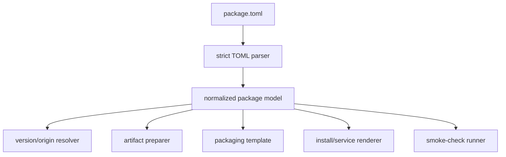

# Package Framework Design

This repository is a small packaging framework, not a collection of hand-written AUR package repos. The long-term goal is that adding a package means adding package-scoped declarative components, not editing the shared CI or publishing flow for one-off behavior.

## Design goals

- Keep `scripts/` and `.github/workflows/` package-agnostic.
- Keep each package's PackageSpec v1 source of truth in `packages/<pkgname>/package.toml`.
- Use package-local `hooks.sh` only when a generic resolver cannot express upstream discovery.
- Use package-local `files/` for static assets such as service units, wrappers, install snippets, licenses, and examples.
- Promote repeated package-local tricks into framework features before they spread.
- Render `PKGBUILD`, `.SRCINFO`, generated install files, and copied assets only in temporary workspaces.
- Provide reusable mechanisms, not package-specific solutions.
- Prefer composition of small framework components over integrated package-specific flows.

## Contract principles

Package definitions are framework contracts. The current contract is PackageSpec v1, loaded from a strict TOML file named `package.toml` and normalized into the internal Bash model used by the existing AUR pipeline:

- PackageSpec v1 is declarative data, not a programming language.
- Specs select and configure framework components; they do not execute workflow logic.
- The framework exposes mechanisms such as upstream resolvers, artifact producers, packaging templates, install/service renderers, smoke-check primitives, detectors, and publishers.
- Packages compose those mechanisms through stable fields rather than triggering package-specific branches in shared scripts or workflow YAML.
- The package directory remains the authority for package behavior. A root manifest, if introduced, may describe discovery scope only and must not contain package behavior.
- Generated AUR outputs remain temporary render products, never source-of-truth package files.
- AUR state remains authoritative for publishing. Detector state and spec fingerprints are cache/dispatch optimizations only.

Avoid adding language features to package specs:

- no loops or conditionals
- no dynamic imports
- no cross-package imports
- no remote includes
- no arbitrary command execution
- no deep inheritance chains

If reuse is needed later, prefer documented, framework-owned profiles with shallow merge semantics over package-authored inheritance trees.

## Component boundaries

Each framework component should have one job and a narrow interface:

| Component | Provides | Must not provide |
|---|---|---|
| Package loader / normalizer | Load PackageSpec v1 `package.toml`, validate schema/type rules, and normalize it into one internal package model | Resolve upstream, render packages, or publish |
| Upstream resolver | Produce `RESOLVED_VERSION`, `RESOLVED_SOURCE_URL_*`, and optional `STATE_*` values | Clone AUR, build, render, validate, or publish |
| Artifact preparer | Produce or locate declared artifacts such as GitHub Release archives | Publish AUR packages or add workflow package branches |
| Packaging template | Render temporary packaging outputs and build package candidates from normalized state | Resolve upstream, read detector cache, or mutate the package source of truth |
| Install/service renderer | Generate or copy declared install/service assets | Decide package update policy or publish behavior |
| Smoke-check runner | Verify installed files and commands declared by the package | Replace real package builds or make publish decisions |
| Update detector | Resolve upstream/spec fingerprints and emit a targeted matrix | Become authoritative state or skip publish-path AUR comparison |
| Publisher | Compare rendered output with the live AUR repo, validate, commit, and push | Trust detector cache as final state or skip validation |

When a package needs behavior outside these boundaries, add or extend a generic component instead of integrating the package into a bespoke flow.

## Package boundary

Each package owns only this shape:

```text
packages/<pkgname>/
  package.toml      # required PackageSpec v1 source of truth
  hooks.sh          # optional, upstream resolution escape hatch
  files/            # optional, static package assets
```

Everything else is shared framework code.

Package-local files should be declared by semantic role, such as patches, local source assets, docs, licenses, service units, wrappers, install scripts, or smoke-test assets. Avoid generic "include everything" behavior because the framework needs to know why a file participates in packaging.

## Naming and terminology rules

- Package directories must match the PackageSpec `name` exactly.
- Prefer kebab-case package names. Versioned library packages may include a dot when that matches Arch naming conventions, such as `wlroots0.20-vmwgfx`.
- Do not repeat binary packaging in `desc`; `-bin` in `name` is enough unless the upstream product name itself contains that wording.
- Architecture-specific source rename fields should include the architecture in the rendered filename, for example `rename = '''${pkgname}-${pkgver}-x86_64.tar.gz'''` under `[inputs.sources.<name>]`.
- Prefer these user-facing terms:
  - **package validation** for build/install/smoke-check verification
  - **smoke checks** for installed-file and command assertions
  - **publish path** for the AUR staging/commit/push flow
  - **artifact** for generated or externally stored build products used as package sources
  - **recipe** for the framework-owned instructions that produce an artifact
  - **storage** for the optional backend where an artifact can be reused or published
  - **source entry** for a rendered `PKGBUILD` `source=()` / `source_<arch>=()` item
- Use kebab-case `scripts/aurpkg.py` and `scripts/ci.sh` command names in docs and workflows.

Generated AUR outputs must not be committed under `packages/`:

- `PKGBUILD`
- `.SRCINFO`
- generated top-level `.install` files

Static install scripts are allowed when they are intentionally maintained under package-local `files/` and referenced with `[install] mode = "static"`.

## Shared pipeline

The shared flow is always:

1. discover package directories by finding PackageSpec v1 `package.toml`
2. load, validate, and normalize the package spec
3. resolve upstream version and direct source URLs
4. prepare declared package artifacts
5. prepare a temporary workspace
6. render package outputs
7. refresh checksums and generate `.SRCINFO`
8. build as the non-root `builder` user in CI/root paths
9. install the package in the validation environment
10. run smoke checks
11. publish rendered outputs to AUR only after validation passes

Workflows should stay thin and call `scripts/ci.sh`. CI bootstrap and event/env argument wiring belong in `scripts/ci.sh`; package framework behavior belongs in `scripts/aurpkg.py`. Workflows should not gain package-specific jobs, matrices, or shell branches.

## Framework dispatch points

Shared scripts may branch on framework concepts. These are acceptable because packages opt into them declaratively:

| Concept | Field | Examples |
|---|---|---|
| Package renderer | top-level `template` | `binary-archive`, `deb-repack`, `appimage-desktop`, `source-meson` |
| Version resolver | `[version] from` | `origin`, `artifact`, `hook`, `fixed` |
| Origin resolver | `[origins.<name>] type` | `github-release` |
| Artifact recipe | `[inputs.artifacts.<name>.recipe] type` | `cargo-build` |
| Artifact storage | `[inputs.artifacts.<name>.storage] type` | `github-release` |
| Source entry | `[inputs.sources.<name>] from` | `github-release-asset`, `artifact`, `hook` |
| Install script | `[install] mode` | `none`, `generated`, `static` |
| Service unit | `[service] mode` | `none`, `generated`, `static` |
| Service scope | `[service] scope` | `user`, `system` |

Shared scripts must not branch on package names.

## Anti-corruption rule

Do not add package-specific logic to `scripts/` or `.github/workflows/`.

Bad:

```bash
if [ "$PKGNAME" = "some-package-bin" ]; then
    # special case
fi
```

Bad:

```yaml
- name: Special package build step
  if: matrix.package == 'packages/some-package-bin'
```

Good:

```toml
template = "binary-archive"

[version]
from = "origin"
origin = "release"

[origins.release]
type = "github-release"

[inputs.sources.binary]
from = "github-release-asset"
origin = "release"
arch = "x86_64"

[service]
mode = "static"
file = "files/some-package.service"
```

If a new package cannot be expressed with existing fields, decide whether the need is:

1. a package-local upstream resolution quirk: add `hooks.sh`
2. a repeated external metadata pattern: add a generic `[origins.*] type`, `[version] from`, or `[inputs.sources.*] from`
3. a repeated packaging layout: add or extend a `template`
4. a one-off static asset: place it under package `files/`

## Hook contract

`hooks.sh` is intentionally an escape hatch, but it should stay narrow.

Preferred hook behavior:

- define `resolve_upstream_state()`
- set `RESOLVED_VERSION`
- set `RESOLVED_SOURCE_URL`, `RESOLVED_SOURCE_URL_X86_64`, `RESOLVED_SOURCE_URL_AARCH64`, etc.
- set `STATE_*` variables when rendered package files need resolved values

Avoid hook behavior that changes rendering or install shape, such as mutating `BINARY_SOURCE_PATH`, `SERVICE_*`, `DOC_FILES`, or template-specific options. If a hook needs to do that, treat it as evidence that the framework is missing a generic field.

When a `STATE_*` value must persist into a rendered `PKGBUILD`, declare it with `[state] persist = ["NAME_WITHOUT_STATE_PREFIX"]` in `package.toml`.

If a future PackageSpec hook system is added, prefer executable phase hooks over sourced Bash. A hook should run as a subprocess with explicit inputs and a structured output file. The framework should validate output keys before using them.

Preferred future hook model:

```text
packages/<pkgname>/hooks/resolve-upstream.sh
```

Allowed hook outputs should stay narrow:

- `RESOLVED_VERSION`
- `RESOLVED_SOURCE_URL`
- `RESOLVED_SOURCE_URL_X86_64`
- `RESOLVED_SOURCE_URL_AARCH64`
- `STATE_*`

Future hooks should not edit generated `PKGBUILD` files, write outside temporary output paths, mutate framework internals, or silently introduce new state keys.

## PackageSpec v1 TOML frontend

PackageSpec v1 uses TOML instead of shell assignments. TOML gives package definitions comments, typed booleans/arrays, literal strings for regexes/templates, and a small parser surface via Python's standard-library `tomllib`.

Current PackageSpec v1 rules:

- Every package declares `spec_version = 1`.
- The loader rejects unsupported spec versions.
- The loader rejects unknown keys/tables and wrong value types before any packaging logic runs.
- The loader normalizes TOML tables into the same internal shell model consumed by resolvers, templates, validation, and publishing.
- Package specs are declarative TOML only; executable logic belongs in explicit package-local hooks or framework components.
- Package specs must not cross-reference shell variables. Template placeholders are expanded by the framework from a small allowlist, for example `'''${pkgname}'''`, `'''${pkgver}'''`, `'''${carch}'''`, `'''${origin_version}'''`, `'''${artifact_rev}'''`, and `'''${artifact_version}'''`.
- Local package assets are declared by role through fields such as `[files] patches`, `[files] docs`, `[files] licenses`, `[install] file`, `[service] file`, wrapper fields, and `[tests]` fields.

The TOML frontend remains only a frontend. Do not let it become a package-authored language with imports, inheritance, conditionals, or execution.

Produced or downloaded package artifacts are modeled as first-class `[inputs.artifacts.<name>]` entries with `[inputs.artifacts.<name>.recipe]`, `[inputs.artifacts.<name>.storage]`, and `[inputs.sources.<name>]` consumers, not as workflow special cases.

## PackageSpec input model

PackageSpec v1 uses a unified input-domain model with these boundaries:

| Target table | Role | Must not do |
|---|---|---|
| `[version]` | Decide package identity (`pkgver`) from a fixed value, an origin, an artifact version, or a narrow version hook | Declare files or build artifacts |
| `[origins.*]` | Provide external metadata such as GitHub release tags, asset lists, registry versions, or release pages | Render directly into `PKGBUILD source=()` or mutate package identity by itself |
| `[inputs.sources.*]` | Declare every `PKGBUILD` source entry, including release assets, direct URLs, local files, VCS sources, and artifact outputs | Build, upload, or cache generated artifacts as hidden side effects |
| `[inputs.artifacts.*]` | Declare generated or reusable artifacts plus framework-owned recipes/storage | Decide `pkgver` implicitly or render into `PKGBUILD` without an explicit source entry |

The design intent is:

```text
origins -> version
origins -> inputs.sources
origins -> inputs.artifacts
inputs.artifacts -> inputs.sources
inputs.sources -> PKGBUILD source entries
```

Rules for this model:

- `version` stays top-level because package identity is not just another input file.
- `origins` stay top-level because they can feed `version`, `inputs.sources`, and `inputs.artifacts`; they are external metadata providers, not package inputs themselves.
- `inputs` is the fixed namespace for things that either become package sources or produce files that become package sources.
- All files consumed by `makepkg` must be visible under `inputs.sources.*`; avoid hiding source entries inside version resolvers or artifact recipes.
- Artifacts remain separate from sources because recipes/storage have side effects such as build, cache lookup, or release upload. A source may consume an artifact, but source resolution should not secretly become a build pipeline.
- Keep the lifecycle fixed: resolve version/origins, prepare artifacts, resolve sources, render/build/test/publish. Do not add package-authored ordered steps, loops, conditionals, imports, or arbitrary commands.

Example shape for a GitHub release asset package:

```toml
[version]
from = "origin"
origin = "release"

[origins.release]
type = "github-release"
repo = "lbjlaq/Antigravity-Manager"
tag_prefix = "v"

[inputs.sources.deb]
from = "github-release-asset"
origin = "release"
arch = "x86_64"
selector = '''^Antigravity\.Tools_.*_amd64\.deb$'''
rename = '''${pkgname}-${pkgver}-x86_64.deb'''
```

Example shape for a repo-built artifact consumed as a source:

```toml
[version]
from = "artifact"
artifact = "zellij-binary"

[origins.zellij]
type = "github-release"
repo = "zellij-org/zellij"
tag_prefix = "v"

[inputs.artifacts.zellij-binary]
type = "archive"
rev = 1
version_template = '''${origin.version}.r${artifact.rev}'''
arches = ["x86_64"]

[inputs.artifacts.zellij-binary.recipe]
type = "cargo-build"
origin = "zellij"

[inputs.artifacts.zellij-binary.storage]
type = "github-release"
repo = "orange-guo/aur-packages"
tag = '''${pkgname}-v${artifact.version}'''

[inputs.sources.binary]
from = "artifact"
artifact = "zellij-binary"
arch = "x86_64"
rename = '''${pkgname}-${pkgver}-x86_64.tar.gz'''
```



## Adding framework features

Add a framework feature when at least one of these is true:

- two packages need the same hook pattern
- a package-specific hook has to mutate rendering/install variables
- a workflow would otherwise need package-specific logic
- a package requires generated files that can be described by stable configuration

Prefer small, declarative fields over broad script rewrites. Keep template changes backward-compatible for existing packages.

## Current known limitations

These are framework limitations, not package-specific exceptions:

- Architecture support is currently centered on `x86_64` and `aarch64` in several helpers.
- The `cargo-build` artifact recipe currently supports `x86_64` only.
- Existing `hooks.sh` is executed in a Bash subprocess; the framework guards against PackageSpec field mutation during hook load and upstream resolution and only accepts whitelisted outputs.
- Some non-GitHub upstreams still require package-local hooks; repeated patterns should be promoted to resolvers.

## Boundary guard

`python3 scripts/aurpkg.py check-framework-boundaries` scans shared automation for package names and obvious package-name branching. It is a safety net, not a complete proof: review still needs to catch upstream-name hardcoding or generic-looking package exceptions. Package names belong under `packages/`, documentation, and generated AUR outputs, not in shared scripts or workflows.

Run it locally before opening PRs that touch automation:

```bash
python3 scripts/aurpkg.py check-framework-boundaries
```

The package validation workflow runs the same guard.

## New package checklist

Before adding a package, answer these questions:

1. Can the package be expressed with an existing `template`?
2. Can version/source state be resolved with existing `[version]`, `[origins.*]`, or `[inputs.sources.*]` components?
3. If `hooks.sh` is needed, does it only resolve upstream state?
4. Are all static assets under package-local `files/`?
5. Are smoke checks declared through `[tests] paths`, `executables`, or `commands`?
6. Did you avoid editing workflows for a package-specific reason?
7. Did you update `README.md` when adding or removing a package?

If the answer to any of the framework questions is no, add a generic mechanism first or call out the exception in review.
