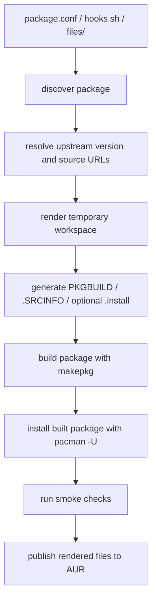
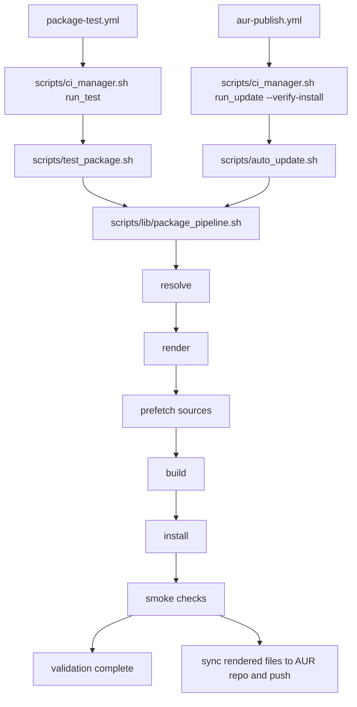
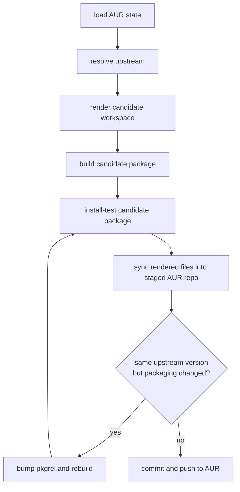
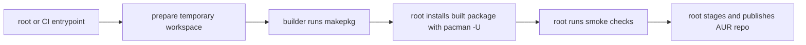

# Workflow Architecture

This document explains how this repository turns `package.conf`-based package definitions into tested AUR updates.

## 1. Source of Truth

Each package directory keeps only the declarative inputs:

- `package.conf` — required package source of truth
- `hooks.sh` — optional upstream-resolution overrides
- `files/` — optional static assets copied into the temporary workspace

Generated packaging files are **not** stored permanently in package directories:

- `PKGBUILD`
- `.SRCINFO`
- generated `.install` files

They are rendered only inside temporary workspaces during local runs and CI.

## 2. High-Level Flow



The critical point is that **publish is gated by the same install smoke-test path used by package validation**.

## 3. Main Entry Points

| Entry point | Purpose |
|---|---|
| `scripts/ci_manager.sh discover` | Find all package directories that contain `package.conf` |
| `scripts/ci_manager.sh run_test <pkg>` | Build, install, and smoke-test one package |
| `scripts/ci_manager.sh run_update <pkg> ...` | Resolve upstream state, render packaging outputs, optionally install-test, and publish to AUR |
| `.github/workflows/package-test.yml` | Pull request / push validation workflow |
| `.github/workflows/aur-publish.yml` | Scheduled/manual publish workflow |

## 4. Shared Package Pipeline

The shared build/install-test logic lives in `scripts/lib/package_pipeline.sh`.

It is responsible for:

1. dispatching upstream resolution
2. rendering the temporary workspace
3. prefetching resolved remote sources into `SRCDEST`
4. building with `makepkg`
5. installing built packages with `pacman -U`
6. running template-driven smoke checks

Both validation and publish now call that same pipeline.



## 5. Validation vs Publish

### Validation path

`run_test` is the thinner path:

- resolve current upstream state
- render a temporary workspace
- build the package
- install it in the test environment
- verify expected installed outputs

It never stages or pushes AUR changes.

### Publish path

`run_update` adds AUR-specific steps around the same build/install-test path:

1. clone or initialize the AUR repo
2. read the current AUR `pkgver` / `pkgrel`
3. resolve the current upstream version
4. render the candidate packaging outputs
5. build the candidate package
6. if requested, install-test the candidate package
7. sync rendered files into the staged AUR repo
8. bump `pkgrel` if packaging changed without an upstream version change
9. commit and push to AUR



## 6. Temporary Workspaces and Outputs

The repository itself remains declarative. Runtime work happens in temporary directories:

- `workspace/` — rendered `PKGBUILD`, `.SRCINFO`, optional generated `.install`, copied `files/`
- `SRCDEST/` — prefetched upstream downloads and checksummed sources
- `PKGDEST/` — built package archives
- `aur/` — cloned or initialized AUR git repository used for staging/push

Only the final rendered AUR outputs are staged into the AUR repo.

## 7. Privilege Boundaries

Builds must still happen as the non-root `builder` user. Install verification and AUR publishing need root or CI orchestration.



In non-root local runs, package builds use the current user. In root/CI paths, the scripts still hand the `makepkg` step to `builder`.

## 8. Smoke Checks

Smoke checks are mostly template-driven. They verify things like:

- `INSTALL_BIN_PATH`
- generated or static service files
- AppImage desktop entries
- license files under `/usr/share/licenses/${PKGNAME}/`
- extra package-specific paths from `TEST_PATHS`
- extra package-specific executables from `TEST_EXECUTABLES`

The checks confirm installation shape, not full runtime behavior.

## 9. Practical Commands

```bash
# Local package validation
./scripts/ci_manager.sh run_test <package_dir>

# Dry-run publish logic without pushing
./scripts/ci_manager.sh run_update <package_dir> --dry-run

# Full publish-path validation (recommended in CI or an ephemeral container)
./scripts/ci_manager.sh run_update <package_dir> --dry-run --verify-install
```

Use `--verify-install` in CI or disposable containers rather than on a long-lived host, because it installs the candidate package before the publish step.
