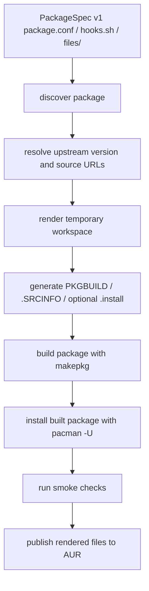
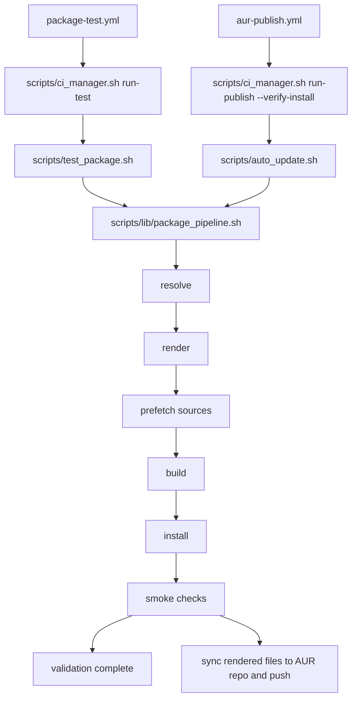
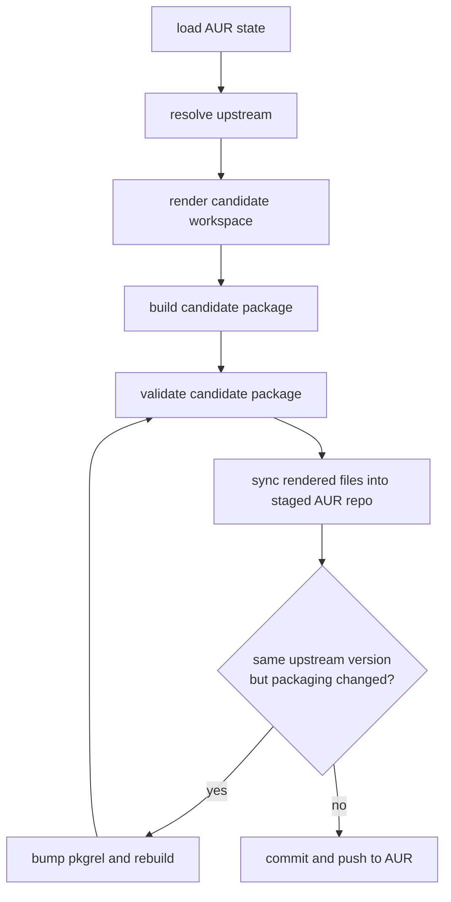
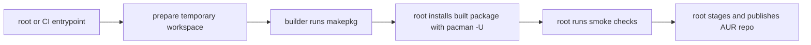

# Workflow Architecture

This document explains how this repository turns PackageSpec v1 `package.conf` definitions into tested AUR updates.

## 1. Source of Truth

Each package directory keeps only the declarative inputs:

- package directories live under `packages/<pkgname>/`

- `package.conf` — required PackageSpec v1 source of truth
- `hooks.sh` — optional upstream-resolution overrides
- `files/` — optional static assets copied into the temporary workspace

Generated packaging files are **not** stored permanently in package directories:

- `PKGBUILD`
- `.SRCINFO`
- generated `.install` files

They are rendered only inside temporary workspaces during local runs and CI.

For AUR metadata, `url` remains the upstream project URL. There is no second structured AUR field for a packaging repository URL, so this repo exposes packaging provenance through a dedicated `# Packaging Repo:` comment in the rendered `PKGBUILD` instead.

## 2. High-Level Flow



The critical point is that **publish is gated by the same package validation path used in pull requests**.

Some `-bin` packages use this repository as the binary-release producer before the normal AUR pipeline consumes the asset. Those packages declare `BINARY_RELEASE_ENABLED=true` in `package.conf`; the generic binary-release workflow builds the upstream source in an Arch container, applies package-local patches, uploads a GitHub Release asset, and then the regular `binary-archive` package template downloads that asset during AUR validation/publish.

## 3. Main Entry Points

| Entry point | Purpose |
|---|---|
| `scripts/ci_manager.sh discover` | Find all package directories that contain PackageSpec v1 `package.conf` |
| `scripts/ci_manager.sh detect-updates` | Resolve upstream state without AUR access and emit a targeted update matrix |
| `scripts/ci_manager.sh discover-binary-releases` | Find packages with `BINARY_RELEASE_ENABLED=true` |
| `scripts/ci_manager.sh build-binary-release <pkgname-or-path>` | Build and publish self-built binary-release assets for one package |
| `scripts/ci_manager.sh preflight <pkgname-or-path>` | Resolve upstream metadata and asset selectors without building or publishing |
| `scripts/ci_manager.sh run-test <pkgname-or-path>` | Build, install, and smoke-check one package |
| `scripts/ci_manager.sh run-publish <pkgname-or-path> ...` | Resolve upstream state, render packaging outputs, optionally run package validation, and publish to AUR |
| `.github/workflows/build-binary-releases.yml` | Scheduled/manual/branch-push producer workflow for repo-built binary-release assets |
| `.github/workflows/package-test.yml` | Pull request / push validation workflow |
| `.github/workflows/aur-publish.yml` | Scheduled/manual publish workflow |

The older snake_case manager commands (`discover_binary_releases`, `build_binary_release`, `run_update`, and `run_test`) remain compatibility aliases. Prefer the kebab-case names in docs and workflows.

Scheduled publishing starts with the update detector. Detector state is only an optimization: it records resolved upstream fingerprints so scheduled runs can avoid unnecessary AUR access, but the publish path still re-resolves upstream and compares against the live AUR repo before publishing.

## 4. Shared Package Pipeline

The shared build and smoke-check logic lives in `scripts/lib/package_pipeline.sh`.

It is responsible for:

1. dispatching upstream resolution
2. rendering the temporary workspace
3. prefetching resolved remote sources into `SRCDEST`
4. building with `makepkg`
5. installing built packages with `pacman -U`
6. running template-driven smoke checks

Both validation and publish now call that same pipeline.

The binary-release producer is separate from the AUR package pipeline. Its shared logic lives in `scripts/build_binary_release.sh`, `scripts/lib/binary_release.sh`, and `scripts/lib/binary_release_source_cargo.sh`. This keeps package-specific binary-release asset recipes declarative in `package.conf` rather than in package-specific workflow YAML.

For validation, discovery is change-aware:

- manual runs can target a single package
- pull requests and normal pushes test only changed packages
- automation changes under `scripts/` or `.github/workflows/` trigger a full sweep

For scheduled publishing, each `aur-publish.yml` package job runs a metadata preflight before build/publish work. The preflight resolves the package's upstream state and validates GitHub asset selectors without building or publishing, so upstream naming changes fail fast with focused logs while preserving package-level isolation.



## 5. Validation vs Publish

### Package validation path

`run-test` is the thinner path:

- resolve current upstream state
- render a temporary workspace
- build the package
- install it in the test environment
- verify expected installed outputs

It never stages or pushes AUR changes.

### Publish path

`run-publish` adds AUR-specific steps around the same build and smoke-check path:

1. clone or initialize the AUR repo
2. read the current AUR `pkgver` / `pkgrel`
3. resolve the current upstream version
4. render the candidate packaging outputs
5. build the candidate package
6. if requested, run package validation for the candidate package
7. sync rendered files into the staged AUR repo
8. bump `pkgrel` if packaging changed without an upstream version change
9. commit and push to AUR



## 6. Temporary Workspaces and Outputs

The repository itself remains declarative. Runtime work happens in temporary directories:

- `workspace/` — rendered `PKGBUILD`, `.SRCINFO`, optional generated `.install`, copied `files/`
- `SRCDEST/` — prefetched upstream downloads and checksummed sources
- `PKGDEST/` — built package archives
- `aur/` — cloned or initialized AUR git repository used for staging/push

Only the final rendered AUR outputs are staged into the AUR repo.

## 7. Privilege Boundaries

Builds must still happen as the non-root `builder` user. Package validation and AUR publishing need root or CI orchestration.



In non-root local runs, package builds use the current user. In root/CI paths, the scripts still hand the `makepkg` step to `builder`.

## 8. Smoke Checks

Smoke checks are mostly template-driven. They verify things like:

- `INSTALL_BIN_PATH`
- generated or static service files
- AppImage desktop entries
- license files under `/usr/share/licenses/${PKGNAME}/`
- extra package-specific paths from `TEST_PATHS`
- extra package-specific executables from `TEST_EXECUTABLES`

The checks confirm installation shape, not full runtime behavior.

## 9. Practical Commands

```bash
# Build/publish repo-produced binary-release assets
./scripts/ci_manager.sh build-binary-release <pkgname-or-path>

# Dry-run the binary-release producer
./scripts/ci_manager.sh build-binary-release <pkgname-or-path> --dry-run

# Local package validation
./scripts/ci_manager.sh run-test <pkgname-or-path>

# Dry-run publish logic without pushing
./scripts/ci_manager.sh run-publish <pkgname-or-path> --dry-run

# Fast metadata/asset selector preflight
./scripts/ci_manager.sh preflight <pkgname-or-path>

# Full publish-path validation (recommended in CI or an ephemeral container)
./scripts/ci_manager.sh run-publish <pkgname-or-path> --dry-run --verify-install
```

Use `--verify-install` in CI or disposable containers rather than on a long-lived host, because it installs the candidate package before the publish step.
