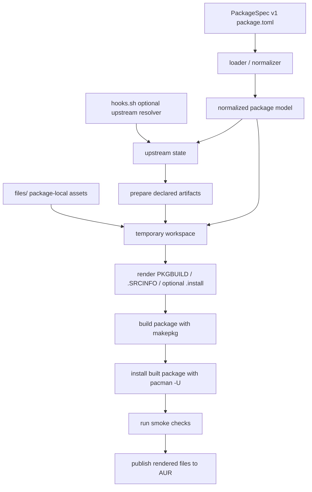
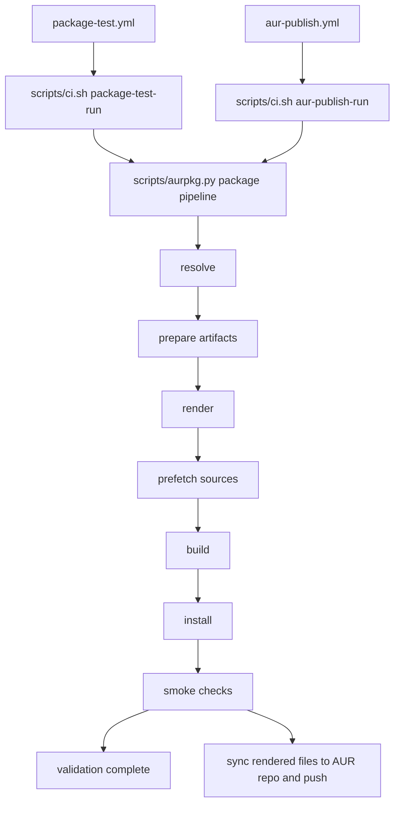
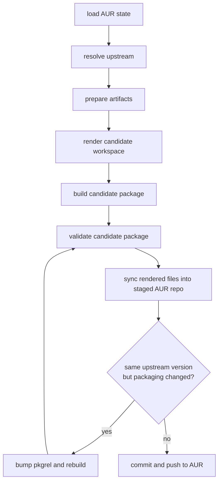
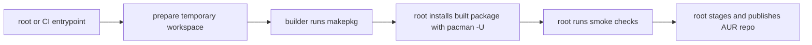

# Workflow Architecture

This document explains how this repository turns PackageSpec v1 `package.toml` definitions into tested AUR updates.

## 1. Source of Truth

Each package directory keeps only declarative package-local state:

- package directories live under `packages/<pkgname>/`

- `package.toml` — required PackageSpec v1 source of truth
- `hooks.sh` — optional upstream-resolution overrides
- `files/` — optional static assets copied into the temporary workspace

Generated packaging files are **not** stored permanently in package directories:

- `PKGBUILD`
- `.SRCINFO`
- generated `.install` files

They are rendered only inside temporary workspaces during local runs and CI.

For AUR metadata, `url` remains the upstream project URL. There is no second structured AUR field for a packaging repository URL, so this repo exposes packaging provenance through a dedicated `# Packaging Repo:` comment in the rendered `PKGBUILD` instead.

## 2. High-Level Flow



The critical point is that **publish is gated by the same package validation path used in pull requests**. Packages that need repo-built products declare them under `[artifacts]`; the normal package lifecycle either verifies an existing artifact, builds a local artifact for validation, or publishes the missing GitHub Release artifact before rendering the AUR package.

## 3. Main Entry Points

| Entry point | Purpose |
|---|---|
| `python3 scripts/aurpkg.py discover` | Find all package directories that contain PackageSpec v1 `package.toml` |
| `python3 scripts/aurpkg.py detect-updates` | Resolve upstream state without AUR access and emit a targeted update matrix |
| `python3 scripts/aurpkg.py prepare-artifacts <pkgname-or-path>` | Resolve, build, check, or publish declared package artifacts for one package |
| `python3 scripts/aurpkg.py preflight <pkgname-or-path>` | Resolve upstream metadata and asset selectors without building or publishing |
| `python3 scripts/aurpkg.py run-test <pkgname-or-path>` | Build, install, and smoke-check one package |
| `python3 scripts/aurpkg.py run-publish <pkgname-or-path> ...` | Resolve upstream state, render packaging outputs, optionally run package validation, and publish to AUR |
| `scripts/ci.sh package-test-*` | CI entrypoint for package validation workflow bootstrap and dispatch |
| `scripts/ci.sh aur-publish-*` | CI entrypoint for AUR publish workflow bootstrap and dispatch |
| `.github/workflows/package-test.yml` | Pull request / push validation workflow |
| `.github/workflows/aur-publish.yml` | Scheduled/manual publish workflow |

The workflow files are thin event surfaces for different GitHub Actions concerns: triggers, permissions, secrets, container usage, and concurrency. Shared CI bootstrap and argument wiring belongs in `scripts/ci.sh`; package framework behavior belongs in `scripts/aurpkg.py`.

Scheduled publishing starts with the update detector. Detector state is only an optimization: it records resolved upstream fingerprints so scheduled runs can avoid unnecessary AUR access, but the publish path still re-resolves upstream and compares against the live AUR repo before publishing.

## 4. Shared Package Pipeline

The shared build and smoke-check logic lives in `scripts/aurpkg.py`.

It is responsible for:

1. dispatching upstream resolution
2. preparing declared package artifacts
3. rendering the temporary workspace
4. prefetching resolved remote sources into `SRCDEST`
5. building with `makepkg`
6. installing built packages with `pacman -U`
7. running template-driven smoke checks

Both validation and publish call that same Python pipeline.

For validation, discovery is change-aware:

- manual runs can target a single package
- pull requests and normal pushes test only changed packages
- automation changes under `scripts/` or `.github/workflows/` trigger a full sweep

For scheduled publishing, each `aur-publish.yml` package job runs a metadata preflight before build/publish work. The preflight resolves the package's upstream state and validates GitHub asset selectors without building or publishing, so upstream naming changes fail fast with focused logs while preserving package-level isolation.



## 5. Validation vs Publish

### Package validation path

`run-test` is the thinner path:

- resolve current upstream state
- prepare declared artifacts in safe mode (`local` in CI package validation)
- render a temporary workspace
- build the package
- install it in the test environment
- verify expected installed outputs

It never stages or pushes AUR changes. `run-test` defaults to `readonly` artifact preparation for local CLI use; CI package validation uses `--artifact-mode local` so artifact recipes can be validated without publishing artifacts.

### Publish path

`run-publish` adds AUR-specific steps around the same build and smoke-check path:

1. clone or initialize the AUR repo
2. read the current AUR `pkgver` / `pkgrel`
3. resolve the current upstream version
4. prepare declared artifacts, publishing missing artifact assets when needed
5. render the candidate packaging outputs
6. build the candidate package
7. if requested, run package validation for the candidate package
8. sync rendered files into the staged AUR repo
9. bump `pkgrel` if packaging changed without an upstream version change
10. commit and push to AUR



## 6. Temporary Workspaces and Outputs

The repository itself remains declarative. Runtime work happens in temporary directories:

- `workspace/` — rendered `PKGBUILD`, `.SRCINFO`, optional generated `.install`, copied `files/`
- `SRCDEST/` — prefetched upstream downloads, local artifacts, and checksummed sources
- `PKGDEST/` — built package archives
- `aur/` — cloned or initialized AUR git repository used for staging/push

Only the final rendered AUR outputs are staged into the AUR repo.

## 7. Privilege Boundaries

Builds must still happen as the non-root `builder` user. Package validation and AUR publishing need root or CI orchestration.



In non-root local runs, package builds use the current user. In root/CI paths, the scripts still hand the `makepkg` step to `builder`.

## 8. Smoke Checks

Smoke checks are mostly template-driven. They verify things like:

- `[package] install_bin_path`
- generated or static service files
- AppImage desktop entries
- license files under `/usr/share/licenses/<pkgname>/`
- extra package-specific paths from `[tests] paths`
- extra package-specific executables from `[tests] executables`

The checks confirm installation shape, not full runtime behavior.

## 9. Practical Commands

```bash
# Check or publish declared package artifacts
python3 scripts/aurpkg.py prepare-artifacts <pkgname-or-path> --artifact-mode readonly
python3 scripts/aurpkg.py prepare-artifacts <pkgname-or-path> --artifact-mode publish

# Local package validation
python3 scripts/aurpkg.py run-test <pkgname-or-path>

# Dry-run publish logic without pushing
python3 scripts/aurpkg.py run-publish <pkgname-or-path> --dry-run

# Fast metadata/asset selector preflight
python3 scripts/aurpkg.py preflight <pkgname-or-path>

# Full publish-path validation (recommended in CI or an ephemeral container)
python3 scripts/aurpkg.py run-publish <pkgname-or-path> --dry-run --verify-install
```

Use `--verify-install` in CI or disposable containers rather than on a long-lived host, because it installs the candidate package before the publish step.
